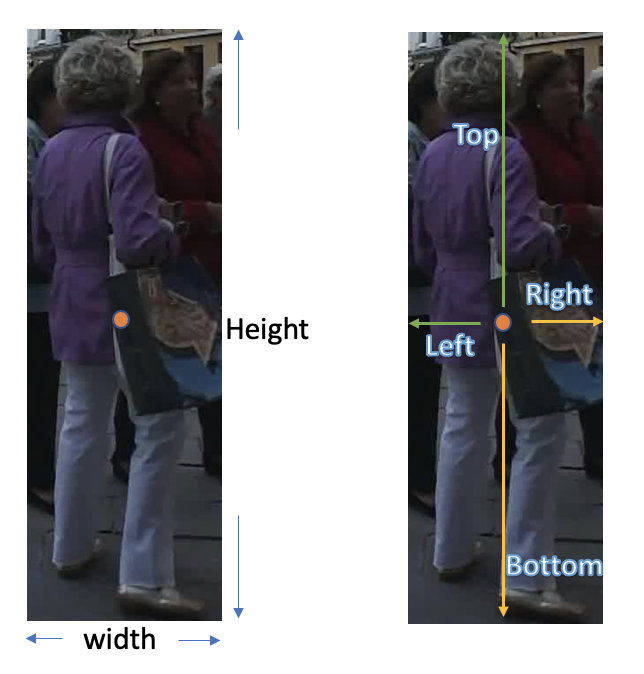
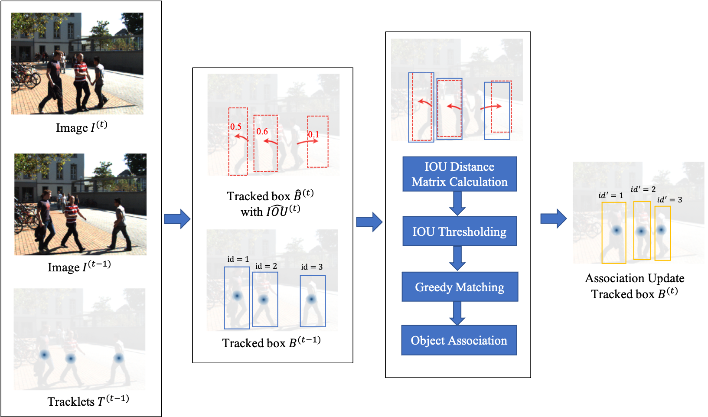
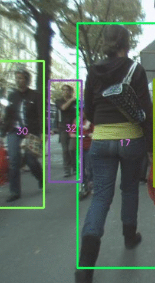

# MOT Tracked object bounding box association (CenterTrack++)
New association method based on CenterTrack. Two new branches (Tracked Size and IOU) are added onto the original CenterTrack tracker. The proposed method enables the computation of IOU distance matrix for more accurate object association compared to single displacement offset in the original CenterTrack.

<p align="center"> </p>
<p align="center">Modification to CenterTrack method, image modified from <a href="https://github.com/xingyizhou/CenterTrack">CenterTrack</a></p>


## Abstract
The recent development of multi-object tracking (MOT) on
point-based joint detection and tracking methods has attracted
much research attention. CenterTrack tracking algorithm is
one of such promising methods. It achieves state-of-the-art
tracking performance using a simple detection model and
single-frame spatial offsets to localize objects and predict
their associations in a single network. However, this method
still suffers from high identity switches due to the inferior
association method. Only point displacement distance matrix
is used to associate objects, which is not robust to deal with
occlusion scenarios. To reduce the high number of identity
switches and improve the tracking accuracy, more effective
spatial information should be used in association. In this paper,
we propose to incorporate a simple tracked object bounding
box and overlapping prediction based on the current frame
onto the CenterTrack algorithm. Specifically, we propose
a Intersection over Union (IOU) distance cost matrix in the
association step instead of point displacement distance. We
evaluate our proposed tracker on the MOT17 test dataset,
showing that our proposed method can reduce identity switches
significantly by 22.6% and obtain a notable improvement of
1.5% in IDF1 compared to the original CenterTrack’s under
the same tracklet lifetime.


## Main Contributions

- Proposed two branches (tracked box size and IOU)on top of the existing CenterTrack method for IOU distance metric computation in object association
- Evaluation the proposed method on MOT17 dataset and obtain significant reduction in IDs and notable improvements in tracking accuracy score

## Two new branches
The idea of the proposed method is to enhance the original displacement only association. Inspired by the IOU distance in [SORT](https://arxiv.org/abs/1602.00763) and [IOU-Tracker](http://elvera.nue.tu-berlin.de/files/1517Bochinski2017.pdf), IOU distance can be used for more accurate object association across frames. IOU distance is calculated as `1 - IOU`(bounding box of detected object in the previous frame and the predicted tracked object bounding box in the previous frame based on the current frame)

### Tracked Object Size prediction
In order to obtain the IOU distance, the bounding box of the tracked object in the previous frame should be learnt. In this project, two methods were used to learn the tracked bounding box. 

**Tracking_wh:** Directly learn the width and height of the tracked object bounding box in the previous frame.

**Tracking_ltrb:** Learn the offsets of the left, top, right and bottom of bounding box from the tracked object center in the previous frame.

<p align="center">  </p>
<p align="center">The tracking_wh(left) and tracking_ltrb(right) approach illustration.</p>

### IOU prediction
To further suppress inaccurate association, the IOU value of the tracked object bounding box in adjacent frames is learnt to provide a threshold to filter unlikely associations. We would set the IOU distance to infinity if  `IOU distance > IOU`.

## Association Method
<p align="center">  </p>


## Main results

### Comparison with other SOTA tracker on MOT17 test set
Note: S= Spatial features, A=appearance features

|       Tracker      | Association Features | MOTA | IDF1 |  IDs |
|:------------------:|:--------------------:|:-------:|:-------:|:----:|
|       TubeTK       |           S          |   63  |  58.6 | 4137 |
|     CenterTrack    |           S          |  67.8 |  64.7 | 3039 |
| Ours               |           S          |  68.1 |  66.2 | 2352 |
|         SST        |           A          |  52.4 |  49.5 | 8431 |
|     CTrackerV1     |          S+A         |  66.6 |  57.4 | 5529 |
|        DEFT        |          S+A         |  66.6 |  65.4 | 2823 |
|       FairMOT      |          S+A         |  73.7 |  72.3 | 3303 |


### Ablative studies on tracked size prediction method

#### Tracking_wh
| Association Method |  IDF1  | MOTA | IDs | FP(%) | FN(%) |
|:------------------:|:--------:|:--------:|:---:|:-----:|:-----:|
|         DIS        |  69.2 |  66.2 | 219 |  3.9  |  29.5 |
|         IOU        |  71.1 |  66.7 | 204 |  3.6  |  29.3 |
|      Combined      |  70.9 |  66.2 | 233 |  3.9  |  29.6 |
|       DIS→IOU      |   70  |  66.2 | 218 |  3.9  |  29.5 |
|       IOU→DIS      |  69.8 |  66.8 | 185 |  3.6  |  29.2 |


#### Tracking_ltrb
| Association Method |  IDF1  | MOTA| IDs | FP(%) | FN(%) |
|:------------------:|:--------:|:--------:|:---:|:-----:|:-----:|
|         DIS        | 69.2  | 66.2  | 219 | 3.9   | 29.5  |
|         IOU        | 72.4  | 66.7  | 191 | 3.8   | 29.2  |
|      Combined      | 70.8  | 66.5  | 236 | 3.8   | 29.3  |
|       DIS→IOU      | 70.5  | 66.6  | 202 | 3.8   | 29.2  |
|       IOU→DIS      | 71.4  | 66.7  | 166 | 3.8   | 29.2  |


## Installation

Please refer to [INSTALL.md](https://github.com/xingyizhou/CenterTrack/blob/master/readme/INSTALL.md) for installation instructions.

## Training and Evaluation
- Download the crowdhuman pretrained model from xinyizhou/CenterTrack [MODEL ZOO.md](https://github.com/xingyizhou/CenterTrack/blob/master/readme/MODEL_ZOO.md) to models
- prepare the data and convert it into COCO format refer to the original [CenterTrack](https://github.com/xingyizhou/CenterTrack) repo.
- change the dataset root directory `data_dir` in `opt.py`
- ablative studies for tracking_wh and tracking_ltrb approach respectively with five association method (IOU,DIS,Combined, IOU→DIS, DIS→IOU)

```bash
sh experiments/mot17val_tracking_wh.sh

sh experiments/mot17val_tracking_ltrb.sh
```
The trained model on MOT17val dataset using two approach are available in google drive, [tracking_ltrb_70val.pth](https://drive.google.com/file/d/1mECRdz8EQq_BgVCxAdMBmBUPREIQ8Zjd/view?usp=sharing), [tracking_wh_70val.pth](https://drive.google.com/file/d/1_R7OPQ7PJlOVAH80BS2iaIofv5ZNXXuq/view?usp=sharing).

- Train on full mot17 training set and run model on the test set for evaluation

```bash
sh experiments/mot17full.sh
```
The trained models on full MOT17 dataset using ltrb approach is available in the [google drive](https://drive.google.com/file/d/1bgnA9ApYwt7D20OBunp0807Kz8ageBOm/view?usp=sharing).

## Demo comparison

#### Occlusion case 
<p>
 
</p>
<p> Original CenterTrack (left) vs CenterTrack++ (right)</p>

#### Object exiting the frame
<p>


</p>
<p> Original CenterTrack (left) vs CenterTrack++ (right)</p>

# Acknowledgement

A large part of the code is adapted from [xingyizhou/CenterTrack](https://github.com/xingyizhou/CenterTrack), thanks for their wonderful inspiration.

# Citation

If you find this paper and code useful in your research, please cite our papers.

```@misc{yang2021multiobject,
      title={Multi-object Tracking with Tracked Object Bounding Box Association}, 
      author={Nanyang Yang and Yi Wang and Lap-Pui Chau},
      year={2021},
      eprint={2105.07901},
      archivePrefix={arXiv},
      primaryClass={cs.CV}
}```
