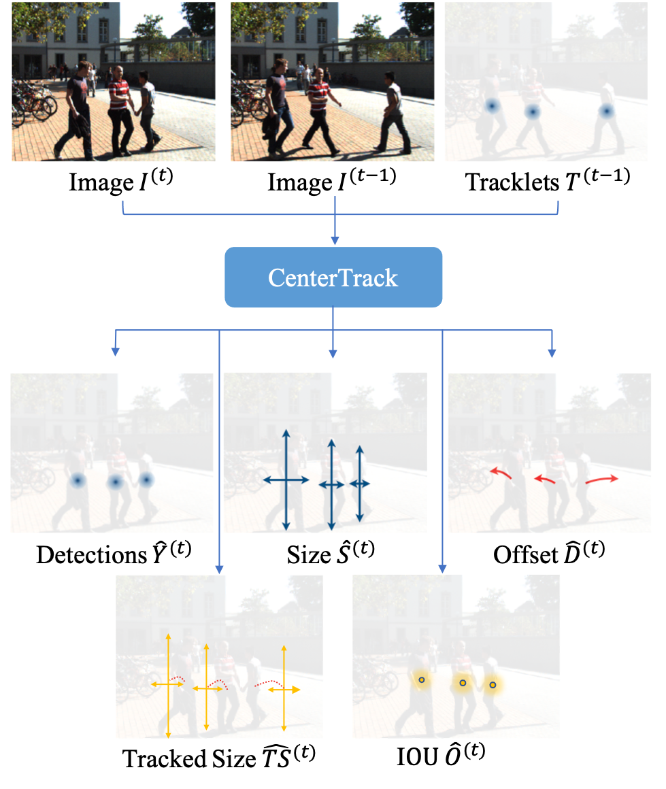
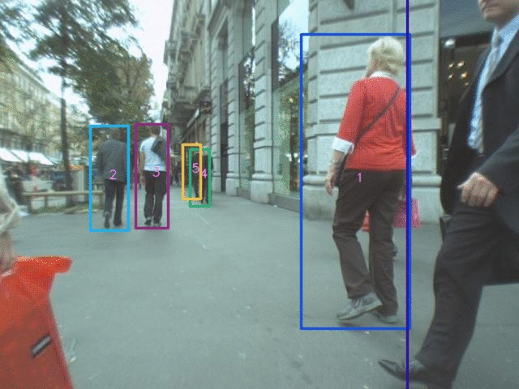
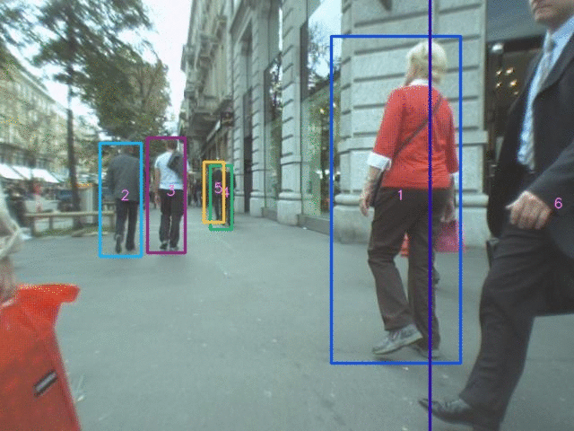
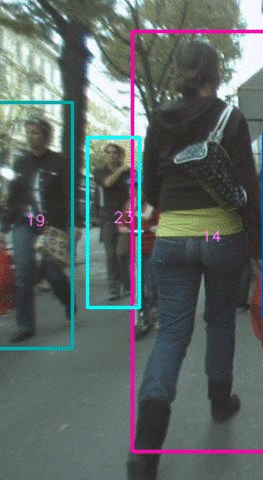

# Tracking Objects as Points
New association method based on CenterTrack



## Abstract
The recent development of multi-object tracking (MOT) on
point-based joint detection and tracking methods has attracted
much research attention. CenterTrack tracking algorithm is
one of such promising methods. It achieves state-of-the-art
tracking performance using a simple detection model and
single-frame spatial offsets to localize objects and predict
their associations in a single network. However, this method
still suffers from high identity switches due to the inferior
association method. Only point displacement distance matrix
is used to associate objects, which is not robust to deal with
occlusion scenarios. To reduce the high number of identity
switches and improve the tracking accuracy, more effective
spatial information should be used in association. In this paper,
we propose to incorporate a simple tracked object bounding
box and overlapping prediction based on the current frame
onto the CenterTrack algorithm. Specifically, we propose
a Intersection over Union (IOU) distance cost matrix in the
association step instead of point displacement distance. We
evaluate our proposed tracker on the MOT17 test dataset,
showing that our proposed method can reduce identity switches
significantly by 22.6% and obtain a notable improvement of
1.5% in IDF1 compared to the original CenterTrack’s under
the same tracklet lifetime.


## Main Contributions

- Proposed two branches (tracked box size and IOU)on top of the existing CenterTrack method for IOU distance metric computation in object association
- Evaluation the proposed method on MOT17 dataset and obtain significant reduction in IDs and notable improvements in tracking accuracy score

## Main results

### Comparison with other SOTA tracker on MOT17 test set

|       Tracker      | Association Features | MOTA­ | IDF1­ |  IDs |
|:------------------:|:--------------------:|:-----:|:-----:|:----:|
|       TubeTK       |           S          |   63  |  58.6 | 4137 |
|     CenterTrack    |           S          |  67.8 |  64.7 | 3039 |
| Ours:CenterTrack++ |           S          |  68.1 |  66.2 | 2352 |
|         SST        |           A          |  52.4 |  49.5 | 8431 |
|     CTrackerV1     |          S+A         |  66.6 |  57.4 | 5529 |
|        DEFT        |          S+A         |  66.6 |  65.4 | 2823 |
|       FairMOT      |          S+A         |  73.7 |  72.3 | 3303 |


### Ablative studies on tracked size prediction method

#### Tracking_wh
| Association Method | IDF1­ | MOTA­ | IDs | FP(%) | FN(%) |
|:------------------:|:-----:|:-----:|:---:|:-----:|:-----:|
|         DIS        |  69.2 |  66.2 | 219 |  3.9  |  29.5 |
|         IOU        |  71.1 |  66.7 | 204 |  3.6  |  29.3 |
|      Combined      |  70.9 |  66.2 | 233 |  3.9  |  29.6 |
|       DIS→IOU      |   70  |  66.2 | 218 |  3.9  |  29.5 |
|       IOU→DIS      |  69.8 |  66.8 | 185 |  3.6  |  29.2 |


#### Tracking_ltrb
| Association Method | IDF1­ | MOTA­ | IDs | FP(%) | FN(%) |
|:------------------:|:-----:|:-----:|:---:|:-----:|:-----:|
|         DIS        | 69.2  | 66.2  | 219 | 3.9   | 29.5  |
|         IOU        | 72.4  | 66.7  | 191 | 3.8   | 29.2  |
|      Combined      | 70.8  | 66.5  | 236 | 3.8   | 29.3  |
|       DIS→IOU      | 70.5  | 66.6  | 202 | 3.8   | 29.2  |
|       IOU→DIS      | 71.4  | 66.7  | 166 | 3.8   | 29.2  |


<p align="center">  </p> 

<p align="center">  </p>


## Installation

Please refer to [INSTALL.md](readme/INSTALL.md) for installation instructions.

## Training and Evaluation
- Download the crowdhuman pretrained model from xinyizhou/CenterTrack [MODEL ZOO.md](https://github.com/xingyizhou/CenterTrack/blob/master/readme/MODEL_ZOO.md) to models
- prepare the data and convert it into COCO format refer to the original [CenterTrack](https://github.com/xingyizhou/CenterTrack) repo.
- change the dataset root directory `data_dir` in `opt.py`
- ablative studies for tracking_wh and tracking_ltrb approach respectively with five association method (IOU,DIS,Combined, IOU→DIS, DIS→IOU)

```bash
sh experiments/mot17val_tracking_wh.sh

sh experiments/mot17val_tracking_ltrb.sh
```

- Train on full mot17 training set and run model on the test set for evaluation

```bash
sh experiments/mot17full.sh
```

## Demo comparison

#### Occlusion case
<p align="left">  </p> 
<p align="right">  </p> 

#### Object exiting the frame
<p align="left">  </p> 
<p align="right">  </p> 


# Acknowledgement

A large part of the code is adapted from [xingyizhou/CenterTrack](https://github.com/xingyizhou/CenterTrack), thanks for their wonderful inspiration.